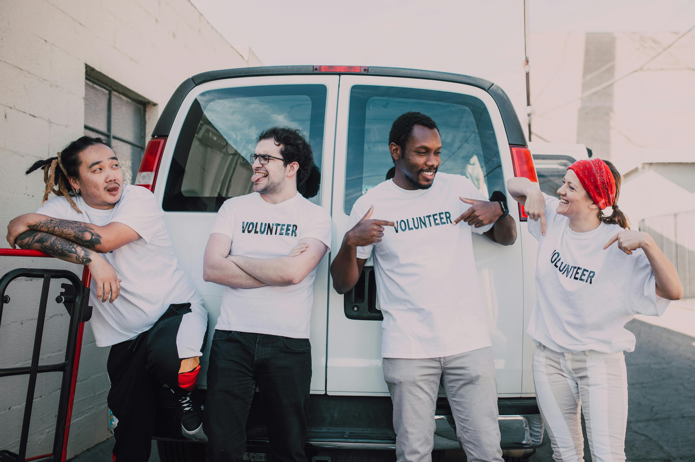

# AidAlley
> Connecting Hearts, Coordinating Hands.



## Table of Contents

- [AidAlley](#aidalley)
  - [Table of Contents](#table-of-contents)
  - [Inspiration](#inspiration)
  - [The Premise](#the-premise)
    - [Blogpost](#blogpost)
  - [The Team](#the-team)
  - [Tech Stack](#tech-stack)
  - [Architecture](#architecture)
  - [Project Structure](#project-structure)
    - [Dependencies](#dependencies)
    - [Features](#features)
    - [Future Plans](#future-plans)
  - [Landing Page](#landing-page)
  - [Acknowledgements](#acknowledgements)
  - [Related Projects](#related-projects)
  - [License](#license)


## Inspiration
Managing volunteers and events efficiently is a challenge every community organizer faces. Yet, volunteer work is essential for community support and growth. This is why we created AidAlley.

AidAlley is a volunteer management platform designed to seamlessly connect volunteers with events. Event organizers can easily create events, while volunteers can browse and find opportunities in their area. If a volunteer finds an event they are interested in, they can register and track their participation. Organizers can manage volunteers, log hours, and ensure everyone stays informed and engaged.

> Key features include viewing detailed event information, receiving notifications, and tracking volunteer hours efficiently.

## The Premise
This project is the **MVP** of our Portfolio Project, concluding our Foundations Year at [Alx Africa](https://www.alxafrica.com/). We were able to choose who we wanted to work with and what we wanted to work on, as long as we present a working program at the end of the three weeks of development.

### Blogpost
> Coming Soon!!!

## The Team
The project was developed by Ebube Ochemba: [`LinkedIn`](linkedin.com/in/ebubechukwu-ochemba-34bab5268) || [`X`](https://x.com/ebube116) || [`Medium`](https://medium.com/@ebube116)

## Tech Stack
- Python
- Flask
- SQLAlchemy
- MySQL
- HTML/CSS
- JavaScript

## Architecture
> Coming Soon!!!

## Project Structure
```sh
AidAlley/
├── api/
│   └── ...
├── models/
│   └── ...
├── web_app/
│   ├── templates/
│   │   ├── base.html
│   │   ├── index.html
│   │   └── ...
│   ├── static/
│   │   ├── ...
│   ├── views/
│   │   ├── index.py
│   │   └── ...
│   └── app.py
├── tests/
│   └── ...
├── .flaskenv
├── .gitignore
├── config.py
├── requirements.txt
├── run.py
└── README.md
```

### Dependencies
- Python 3.10+
  - bcrypt 4.1.3
    - pynacl==1.5.0
- Flask 3.0.3
  - Flask-Cors 4.0.1
  - Flask-JWT-Extended==4.6.0
  - Flask-SQLAlchemy==3.1.1
- MySQL 8.0.37 # mysqlclient
  - mysql==8.0.37
  - MySQLdb==2.1.1
- SQLAlchemy 2.0.29
- ...

### Features
- [x] Login & Logout Experiences
- [x] View Events
- [x] Event Creation
- [x] Event Management
- [x] Event Signup

### Future Plans


## Landing Page
> Coming Soon!!!

## Acknowledgements
All work contained in this project was completed as part of the curriculum for Alx. ALX is a leading technology training provider, built to accelerate the careers of young Africans through the technology and professional skills that enable them to thrive in the digital economy. The program prepares students for careers in the tech industry using project-based peer learning. For more information, visit [Alx Africa](https://www.alxafrica.com/).

## Related Projects
[AirBnB Clone](https://github.com/Ebube-Ochemba/AirBnB_clone): A simple web app made with Python, Flask, and JQuery.

## License
[MIT License](/LICENSE)